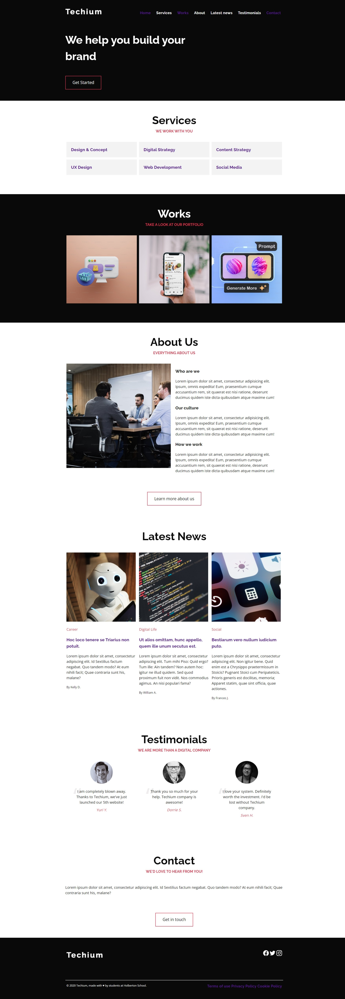

# 0x02. Advanced CSS

# Project Overview

This project focuses on advanced CSS techniques, including the use of custom properties, responsive design, and theming. It demonstrates various styling methods to enhance web aesthetics and functionality.

## Files

| File Name          | Description                                    |
|--------------------|------------------------------------------------|
| 0-style.css        | Base styles for the project                    |
| 1-style.css        | Adds custom properties for colors               |
| 2-style.css        | Sets background and text colors                 |
| 3-style.css        | Sets font styles for text                       |
| 4-style.css        | Custom font-family properties                   |
| 5-style.css        | Font size variables                             |
| 6-style.css        | Font weight variables                           |
| 7-style.css        | Integration of Google Fonts                     |
| 8-style.css        | Line height variables                           |
| 9-style.css        | Removes default link decorations                |
| 10-style.css       | Centers section titles                          |
| 11-style.css       | Styles section tagline                          |
| 12-style.css       | Styles section title                           |
| 13-style.css       | Styles links with pseudo-classes                |
| 14-style.css       | Normalizes CSS for consistency                  |
| 15-style.css       | Universal box-sizing rule                       |
| 16-style.css       | Styles the container element                    |
| 17-style.css       | Adds padding to sections                        |
| 18-style.css       | Customizes the navbar                           |
| 19-style.css       | Grid styling and custom variables               |
| 20-style.css       | Clears context of the grid                      |
| 21-style.css       | Simplifies column selectors                      |
| 22-style.css       | Adds dark theme styles                          |
| 23-style.css       | Fixes issues for dark theme                     |
| 24-style.css       | Adds background and hover state to services     |
| 25-style.css       | Adds border to buttons                          |
| 26-style.css       | Adds border radius to images                    |
| 27-style.css       | Styles the hero section                         |
| 28-style.css       | Fixes header and menu navigation bar            |
| 29-style.css       | Styles nav items and transitions                |
| 30-style.css       | Fixes the works section                        |
| 31-style.css       | Adds quotes decoration on testimonials          |
| 32-style.css       | Incorporates transitions                        |

## Website Preview: visual result

