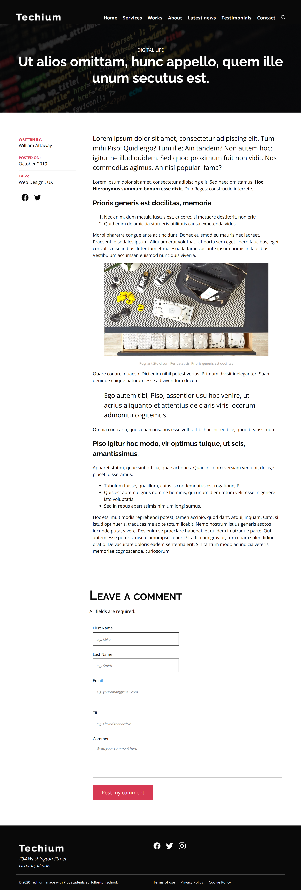

# 0x03. Responsive design

## Overview

This project emphasizes responsive design principles using HTML and CSS. It addresses various layout issues, implements flexible containers, and enhances navigation for different screen sizes.

## Files

| File Name             | Description                                      |
|-----------------------|--------------------------------------------------|
| 01-index.html         | Starter HTML file for the hero section           |
| 01-styles.css         | Styles for the hero section                       |
| 02-index.html         | Updated HTML with flexible container              |
| 02-styles.css         | Styles for responsive layout                      |
| 02-1-index.html       | Enhanced layout HTML with media queries           |
| 02-1-styles.css       | Styles including mobile-first approach            |
| 03-index.html         | HTML with responsive images                       |
| 03-styles.css         | Styles for handling responsive images             |
| 04-index.html         | HTML with mobile navigation icon                  |
| 04-styles.css         | CSS for mobile menu behavior                      |
| 05-index.html         | HTML with hamburger icon                          |
| 05-styles.css         | Styles for hamburger menu                         |
| 06-index.html         | Updated HTML with menu behavior                   |
| 06-styles.css         | Final styles for mobile navigation                |
| 07-index.html         | HTML with responsive typography                   |
| 07-styles.css         | Styles for dynamic font sizes                     |
| 08-index.html         | HTML for the Works section                        |
| 08-styles.css         | Styles to improve the Works section               |
| 09-index.html         | HTML for the Footer section                       |
| 09-styles.css         | Styles for responsive footer                      |
| 10-index.html         | HTML for the article page                         |
| 10-styles.css         | Styles for article section                        |
| 100-article.html      | HTML for an individual article                    |
| 100-styles.css        | Styles for article layout                         |

## Websites Preview
### 10-index.html

- Desktop:

- Mobile:

## 100-article.html

